> Full-Stack Developer | AI/ML | Data Science 
> cooking up real projects fr 🍳

shipping fast, testing on real users, and ghosting what doesn't work. currently locked in and building cool stuff. 
grinding DSA > doomscrolling TikTok 💀

 

 

Top 

<table width="100%" style="border: none; border-collapse: collapse;">
  <tr>
    <td width="70%" valign="top">

**[RepoOwl-extension](https://github.com/YASHK-arch/RepoOwl-extension)** &nbsp;·&nbsp; <samp>javascript, typescript, plpgsql</samp> 
AI-powered GitHub issue triage & duplicate detection. Automate your workflow, 
surface technical insights, and keep your repository organized with LLMs.

**[OmniReceipt-parser](https://github.com/YASHK-arch/OmniReceipt-parser)** &nbsp;·&nbsp; <samp>typescript, next.js</samp> 
Turn physical receipts into structured data instantly. Built with Next.js and 
Google Gemini, featuring built-in edge-case handling and analysis logs.

**[VISION_RUSH-Deepfake-Detection-Engine](https://github.com/YASHK-arch/VISION_RUSH-Deepfake-Detection-Engine)** &nbsp;·&nbsp; <samp>python, pytorch</samp> 
Self-trained deepfake video detection system built using a Vision Transformer 
(ViT-B/14 with DINOv2 backbone).

</td>
<td width="25%" align="center" valign="middle">

</td>
</tr>
</table>

 

<table style="border: none; border-collapse: collapse;">
<tr>
<td align="center" valign="middle" width="160">

  

</td>
<td align="center">

</td>
</tr>
</table>
 

 

 

 

<table width="100%" style="border: none; border-collapse: collapse;">
  <tr>
    <td width="70" align="center" valign="middle">
      
    </td>
    <td>
      <b>Contributor @ GSSOC '26</b> 
      GirlScript Summer of Code
    </td>
  </tr>
  <!-- <tr>
    <td width="70" align="center" valign="middle">
      
    </td>
    <td>
      <b>Project Developer and Maintainer @ RepoOwl @ SWOC 2026</b> 
      Social Winter of Code
    </td>
  </tr> -->
</table>
