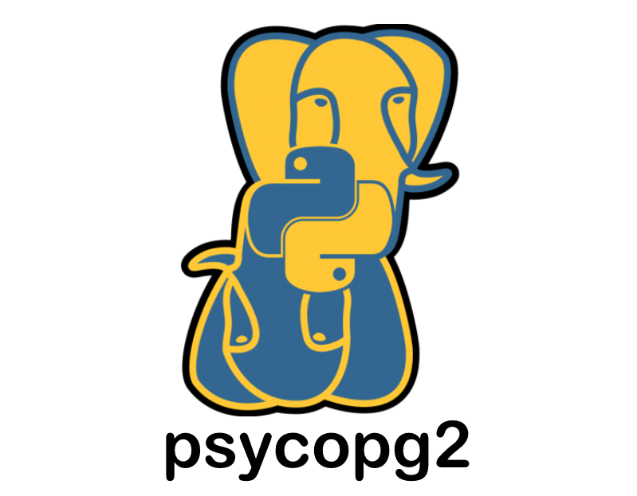

<!-- ╔══════════════════════════════════════════════════════════════════════╗ -->
<!-- ║              YASH KUMAR — HOLOGRAPHIC TERMINAL PROFILE              ║ -->
<!-- ╚══════════════════════════════════════════════════════════════════════╝ -->

<div align="center">


<!-- ░░░░░░░░░░░░░ TYPING ANIMATION ░░░░░░░░░░░░░ -->
<br/>


<br/><br/>

<!-- ░░░░░░░░░░░░░ SOCIAL BADGES ░░░░░░░░░░░░░ -->
<a href="https://linkedin.com/in/yash-kumar-836847279">
  
</a>
<a href="mailto:yashkumar02006@gmail.com">
  
</a>
<a href="https://www.youtube.com/@beyondyourthoughts">
  
</a>
<a href="https://x.com/Yash%20Kumar">
  
</a>

<br/>

</div>

---

<div align="center">

## `[ SYS ] >> LOADING PROFILE...`

</div>

---

## `$ cat whoami.json`

<table align="right" style="border:none;">
  <tr>
    <td style="border:none;">
      <br/>
      
    </td>
  </tr>
</table>

```json
{
  "user"         : "Yash Kumar",

   "bossFights" : [
    "Merge Conflicts",
    "Firebase Rules",
    "npm Dependencies",
    "Off-by-One Errors"
  ],

  "achievements" : [
    "Debugged a bug by adding console.log()",
    "Won an argument against CSS",
    "Survived Production Deployment",
    "Touched Grass (rare achievement)"
  ],

  "powerUps" : [
    "Coffee ☕",
    "Stack Overflow",
    "GitHub Issues",
    "ChatGPT"
  ],

  "status" : "████████░░ 80% caffeinated"
}
```

<br clear="right"/>

---

## `$ lspci --tech-stack`

<div align="center">
<br/>


<br/>

 
 





</div>

---

## `$ github-cli stats --user YASHK-arch --verbose`

<div align="center">

```
 FETCHING DATA FROM GITHUB API...  [████████████████████] 100%  OK
```

<table>
  <tr>
    <td align="center">
      <a href="https://github.com/YASHK-arch?tab=repositories"></a>
      <a href="https://github.com/YASHK-arch?tab=followers"></a>
      <br/><br/>
      
    </td>
    <td>
      
    </td>
  </tr>
</table>

</div>

---

## `$ git log --graph --all --commits`

<div align="center">

```
 PLOTTING COMMIT ACTIVITY...  [████████████████████] OK
```


</div>

---

## `$ run snake-animation --render`

<div align="center">

```
 RENDERING CONTRIBUTION GRID...  [████████████████████] DONE
```

<picture>
  <source media="(prefers-color-scheme: dark)" srcset="https://raw.githubusercontent.com/YASHK-arch/YASHK-arch/output/github-snake-dark.svg" />
  <source media="(prefers-color-scheme: light)" srcset="https://raw.githubusercontent.com/YASHK-arch/YASHK-arch/output/github-snake.svg" />
  
</picture>

</div>


<!--
╔══════════════════════════════════════════════════════════════╗
║              🐍 SNAKE ANIMATION SETUP (1-TIME)              ║
╠══════════════════════════════════════════════════════════════╣
║                                                              ║
║  Create: .github/workflows/snake.yml in YASHK-arch repo     ║
║                                                              ║
║  name: Generate Snake Animation                              ║
║  on:                                                         ║
║    schedule:                                                 ║
║      - cron: "0 */12 * * *"                                  ║
║    workflow_dispatch:                                        ║
║    push:                                                     ║
║      branches: [main]                                        ║
║  jobs:                                                       ║
║    generate:                                                 ║
║      permissions:                                            ║
║        contents: write                                       ║
║      runs-on: ubuntu-latest                                  ║
║      steps:                                                  ║
║        - name: generate snake.svg                            ║
║          uses: Platane/snk/svg-only@v3                       ║
║          with:                                               ║
║            github_user_name: YASHK-arch                     ║
║            outputs: |                                        ║
║              dist/github-snake.svg                           ║
║              dist/github-snake-dark.svg?palette=github-dark  ║
║        - name: push to output branch                         ║
║          uses: crazy-max/ghaction-github-pages@v3.1.0        ║
║          with:                                               ║
║            target_branch: output                             ║
║            build_dir: dist                                   ║
║          env:                                                ║
║            GITHUB_TOKEN: ${{ secrets.GITHUB_TOKEN }}         ║
╚══════════════════════════════════════════════════════════════╝
-->
